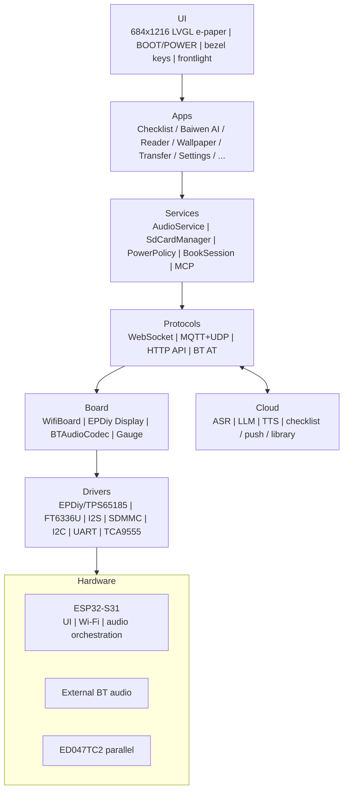
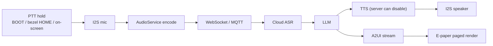
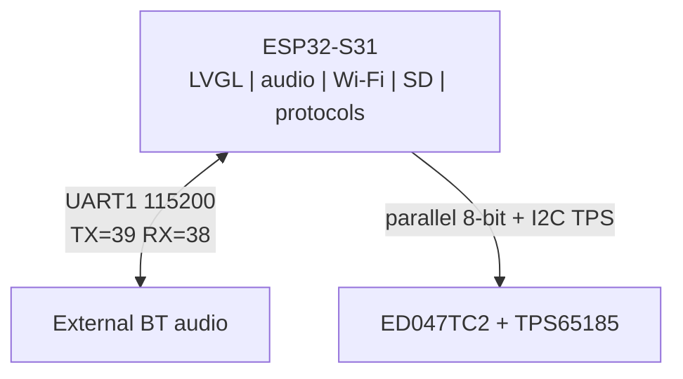
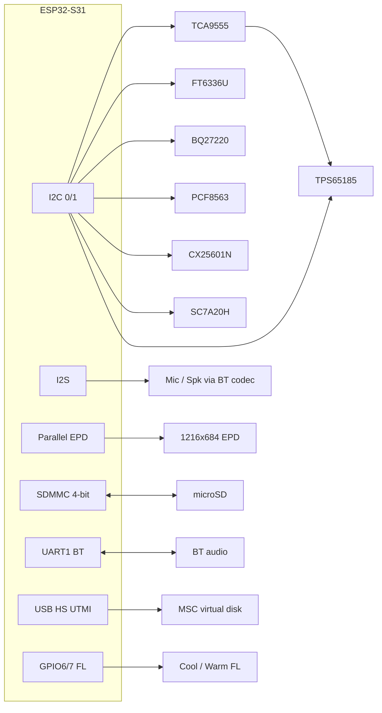
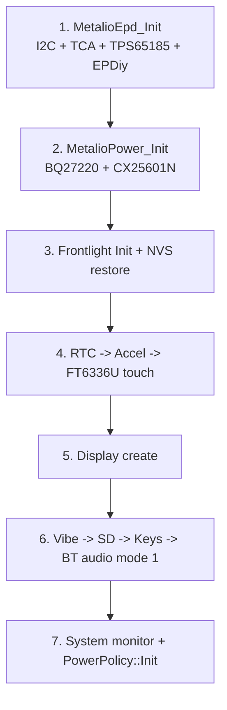

# Metalio E-Ink4-Plus

<p align="center">
  
</p>

[中文](README_zn.md) | **English**

**Quick links**

- ESP-IDF docs: [ESP32-S31 Get Started](https://docs.espressif.com/projects/esp-idf/en/v6.1/esp32s31/get-started/index.html)
- Sibling product: [Metalio E-Ink 4](https://github.com/CloudZao/Metalio-E-INK4) (3.97" SPI)

---

## Contents

1. [Product overview](#1-product-overview)
2. [Core features](#2-core-features)
3. [Use cases](#3-use-cases)
4. [System architecture](#4-system-architecture)
5. [Hardware specs](#5-hardware-specs)
6. [Network architecture](#6-network-architecture)
7. [Peripherals and pins](#7-peripherals-and-pins)
8. [Schematics and docs](#8-schematics-and-docs)
9. [Software architecture](#9-software-architecture)
10. [Cloud services and APIs](#10-cloud-services-and-apis)
11. [Built-in apps](#11-built-in-apps)
12. [Protocols](#12-protocols)
13. [Development environment](#13-development-environment)
14. [Build and flash](#14-build-and-flash)
15. [Debug and FAQ](#15-debug-and-faq)

---

## 1. Product overview

**Metalio E-Ink4-Plus** is an open-source e-ink device for reading and AI-assistant scenarios. It uses a **4.7" parallel** e-paper panel (**ED047TC2**, native **1216x684** / UI portrait **684x1216**) driven by **EPDiy** and **TPS65185**, with **FT6336U** capacitive touch, cover-glass virtual keys, cool/warm frontlight, I2S mic/speaker via an external Bluetooth audio chip, microSD (**SDMMC 4-bit**), on-chip Wi-Fi, SC7A20H accelerometer, PCF8563 RTC, BQ27220 fuel gauge, vibration motor, and USB MSC virtual disk. The device supports cloud AI voice, local library reading, cloud content push, standby wallpapers, SD storage, and low-power management.

| Attribute | Description |
|:---|:---|
| **Product name** | Metalio E-Ink4-Plus |
| **Board id** | `metalio-e-ink4-plus` (`BOARD_NAME` / SoftAP prefix `MetalioEInk4Plus`) |
| **MCU** | **ESP32-S31** (RISC-V; Flash **16 MB**, Octal PSRAM @ **200 MHz**) |
| **Display** | 4.7" parallel e-paper, ED047TC2_1216; FT6336U touch; dual-channel frontlight |

Product data lives under SD `metalio/e-ink/`. Cloud APIs use **ink-screen** push and library sync. The e-paper UI uses full / partial refresh; lists and the reader do not scroll.

> Compared with [Metalio E-Ink 4](https://github.com/CloudZao/Metalio-E-INK4): Plus moves to **ESP32-S31**, a **larger parallel** panel + frontlight, and a different pin / USB architecture. Do not reuse the 397 SPI pin map.

---

## 2. Core features

### 2.1 AI voice

- **Streaming ASR / LLM / TTS**: WebSocket or MQTT+UDP
- **Baiwen AI**: Push-to-Talk + A2UI paged UI; can create Daily checklist items by voice (see [11.2](#112-baiwen-ai-assistant))

### 2.2 E-paper reading

- **E-paper UI**: LVGL I1 / A2I1 via EPDiy; full and partial refresh; lists and reader **must not scroll** -- page with bezel keys or volume keys (TCA9555 **P1.0** + / **P1.1** -)
- **Logical UI size**: 684x1216 with content insets (`DISPLAY_CONTENT_*` in `config.h`)
- **Library**: 3x3 cover grid -> detail -> body; `.ebook` / `.epub` / `.txt`
- **Fonts**: UI fontpack on Flash `font_data`; reader `.ef` fonts on SD or via Transfer
- **Toolchain**: `tools/ebook/` converts PDF/EPUB/MOBI/TXT to device `.ebook` (with Web preview)

### 2.3 Local multimodal features

- **Daily checklist**: cloud sync + local cache (also shown on classic standby)
- **Wallpaper**: SD gallery; can be standby fullscreen or shutdown image
- **Transfer**: cloud push of books, wallpapers, fonts to SD
- **Frontlight**: cool / warm / both / off (Settings -> Frontlight; GPIO6/7)
- **Sensors**: SC7A20H accel; PCF8563 RTC; BQ27220 gauge

### 2.4 Connectivity

- **Wi-Fi**: ESP32-S31 2.4 GHz; AP name like `MetalioEInk4Plus-xxxx`
- **Bluetooth audio**: external chip over UART AT, three modes (see [12.1](#121-bluetooth-audio-three-modes))
- **Virtual USB disk**: Settings -> Storage exposes microSD as USB MSC (TinyUSB on S31 **HS UTMI**; path select via **ANA_SW** GPIO36)

### 2.5 Power and battery life

- **Single-cell Li-ion** + TI **BQ27220** (I2C 0x55); SOC is voltage-linear (see `docs/battery-soc-and-charge.md`)
- **Charging**: **USB -> CX25601N** (I2C 0x6B); default charge current **1000 mA**
- **Power key**: side key (TCA9555 **P1.7**); firmware pulses **P1.3** (`PWR_KEY_PULSE`) for software power-off
- **Idle policy** (Settings -> Power, `PowerPolicy`):
  - **Idle -> light-sleep standby**: default **3 min** (10 / 30 optional) -> standby overlay (classic clock / wallpaper)
  - **Standby cumulative power-off**: default **3 min** (10 / 30 optional)
  - **AppIdle CPU**: 80 / 160 / **240 MHz** (default 240); Wi-Fi may be turned off to save power
  - **Network grace**: keep network **30 / 60 / 120 s** after needs clear
- **Buttons**:
  - **POWER short press**: enter / leave standby overlay
  - **POWER long press ~3 s**: hard power-off
  - **BOOT long press ~500 ms**: Baiwen PTT / standby hold-through, etc. (`power_policy.h`)

PA enable is TCA9555 **P0.4** (`PA_EN`, NS4150 CTRL), policy-driven (phone/BT / Speaking / audio tests).

---

## 3. Use cases

Home enables these six apps (`home_screen.cc` -> `kApps[]`):

| App | Typical use |
|:---|:---|
| **Daily checklist** | Cloud todos: sync, complete, delete |
| **Baiwen AI** | Push-to-talk Q&A with A2UI; can create Daily checklist items by voice |
| **Reader** | Local library browse and paged reading (volume keys P1.0 / P1.1) |
| **Wallpaper** | Wallpaper gallery; standby / shutdown art |
| **Transfer** | Cloud push of books, wallpapers, fonts |
| **Settings** | Network, theme, language, haptics, power, frontlight, conversation, storage, Bluetooth, test, about |

---

## 4. System architecture



### 4.1 Voice data path (Baiwen)



---

## 5. Hardware specs

| Category | Spec |
|:---|:---|
| **MCU** | ESP32-S31; Flash 16 MB; Octal PSRAM @ 200 MHz |
| **Storage** | On-board Flash (`partitions/v1/16m.csv`) + microSD (SDMMC **4-bit**) |
| **Display** | ED047TC2_1216, ~4.7", native 1216x684 / UI 684x1216; EPDiy parallel 8-bit; TPS65185 PMIC |
| **Touch** | FT6336U (I2C 0x38); INT=GPIO5; RST=TCA9555 **P1.2** (high = powered) |
| **Frontlight** | Cool GPIO6 / Warm GPIO7 (YX6016N EN/PWM) |
| **Bezel keys** | HOME / PREV / NEXT (FT coords; see [7.1](#71-esp32-s31-gpio)) |
| **Audio** | External BT audio + I2S duplex @ 16 kHz; codec / speaker / headset |
| **Network** | On-chip Wi-Fi |
| **Bluetooth** | External audio chip UART (GPIO 39/38, 115200); not ESP Classic BT stack |
| **Sensors** | SC7A20H accel (INT wired with TCA INT -> GPIO2); PCF8563 RTC (INT = TCA **P1.6**) |
| **Power** | Single-cell + BQ27220; CX25601N charger; TPS65185 for panel; rails via TCA **P0.5** / **P1.4** |
| **Haptics** | TCA9555 **P0.3** motor (active high; default ~50 ms pulse) |
| **Audio PA** | TCA9555 **P0.4** (`PA_EN`) |
| **Buttons** | BOOT (GPIO61); POWER = TCA **P1.7**; Vol+ = **P1.0**, Vol- = **P1.1** |
| **USB** | S31 HS UTMI MSC virtual disk; **ANA_SW** (GPIO36) selects path |

---

## 6. Network architecture

Metalio E-Ink4-Plus is built around **ESP32-S31** with on-chip Wi-Fi:



| Unit | Role | Interface | Duties |
|:---|:---|:---|:---|
| **ESP32-S31** | Host | - | UI, audio orchestration, Wi-Fi, SD, protocols, MCP, reader |
| **BT audio** | Codec / speaker / headset | UART AT + I2S | Three modes (12.1) |
| **TPS65185** | Panel PMIC | I2C via TCA control pins | VCOM / power-up / PWR_GOOD |

> Networking is Wi-Fi. Provision and connect under **Settings -> Network**.

---

## 7. Peripherals and pins

Pins: `main/boards/metalio-e-ink4-plus/config.h`  
Board glue: `main/boards/metalio-e-ink4-plus/display/epd_board_metalio_eink4_plus.c`  
(Hardware rev notes in `config.h`: e.g. XSTL / MODE for V1.3-V1.4.)

### 7.1 ESP32-S31 GPIO

| Function | GPIO | Notes |
|:---|:---:|:---|
| I2C SDA | 0 | Shared: TCA9555, FT6336U, BQ27220, RTC, charger, accel, TPS65185 |
| I2C SCL | 1 | |
| IO expander INT | 2 | TCA (+ accel INT wired) |
| EPD XSTL | 4 | V1.3/V1.4 |
| Touch INT | 5 | FT6336U |
| Frontlight cool | 6 | |
| Frontlight warm | 7 | |
| EPD D0-D7 | 8-15 | Parallel data |
| EPD XCL / XLE / XOE | 16 / 17 / 18 | |
| EPD MODE | 19 | V1.4 |
| SDMMC D0-D3 | 20-23 | 4-bit |
| SDMMC CLK / CMD | 24 / 25 | |
| EPD SPV / BORDER / CKV | 35 / 37 / 40 | |
| ANA_SW | 36 | MSC path select (low = virtual disk) |
| BT audio TX / RX | 39 / 38 | UART1, 115200 |
| I2S BCLK / WS / DOUT / DIN | 42 / 43 / 44 / 45 | Duplex |
| BOOT | 61 | |

**Bezel virtual-key coordinates** (FT native; Y~1600 is outside the panel):

| Key | X | Y | Typical use |
|:---|:---:|:---:|:---|
| HOME | 100 | 1600 | Back / Baiwen PTT long-press |
| PREV | 200 | 1600 | Back / previous page |
| NEXT | 300 | 1600 | Next page |

### 7.2 TCA9555 (I2C 16-bit, addr 0x20)

| Logic pin | HW | Dir | Function |
|:---|:---|:---:|:---|
| VCOM_CTRL | P0.0 | OUT | TPS65185 VCOM |
| PWRUP | P0.1 | OUT | TPS65185 power-up |
| WAKEUP | P0.2 | OUT | TPS65185 wake |
| MOTOR | P0.3 | OUT | Vibration (active high) |
| PA_EN | P0.4 | OUT | NS4150 PA enable |
| CAM_SCR_EN | P0.5 | OUT | Camera/screen rail |
| PWR_GOOD | P0.7 | IN | TPS65185 PG |
| VOLUME_UP | P1.0 | IN | Volume + |
| VOLUME_DOWN | P1.1 | IN | Volume - |
| TP_RST | P1.2 | OUT | FT6336 power/RST (high = on) |
| PWR_KEY_PULSE | P1.3 | OUT | Shutdown pulse to power IC |
| BT_PA_PWR | P1.4 | OUT | BT + PA rail |
| RTC_INT | P1.6 | IN | PCF8563 INT |
| POWER | P1.7 | IN | Power key |

> Schematic "P1x" means Port1 bit x -- do not confuse with decimal pin numbers.

### 7.3 I2C addresses

| Device | 7-bit addr | Notes |
|:---|:---:|:---|
| TCA9555 | 0x20 | IO expander |
| FT6336U | 0x38 | Touch |
| PCF8563 | 0x51 | RTC |
| BQ27220 | 0x55 | Fuel gauge |
| CX25601N | 0x6B | Charger |
| SC7A20H | 0x19 (alt 0x18) | Accel |
| TPS65185 | (PMIC) | Panel boost / VCOM |

### 7.4 Peripheral diagram



---

## 8. Schematics and docs

| Doc | Path |
|:---|:---|
| Battery / charge policy | [docs/battery-soc-and-charge.md](docs/battery-soc-and-charge.md) |
| EPD Bayer dither | [docs/epd-bayer-dither-gray.md](docs/epd-bayer-dither-gray.md) |
| SD font / resources | [docs/sd-font-resources-upgrade.md](docs/sd-font-resources-upgrade.md) |

Firmware pin truth is `config.h` / `epd_board_metalio_eink4_plus.*`. If schematics are published elsewhere, follow the hardware team docs.

---

## 9. Software architecture

Firmware is based on xiaozhi-esp32, customized for `metalio-e-ink4-plus`. CMake project name `Metalio-E-Ink4-Plus`.

### 9.1 Layers

| Layer | Path / module | Role |
|:---|:---|:---|
| **Entry** | `main.cc` -> `Application` | Boot, event loop, state machine |
| **Board** | `boards/metalio-e-ink4-plus/` | HW init, EPDiy, touch, keys, frontlight |
| **Display** | `display/screen/*`, `lv_adapter_*` | Apps, e-paper refresh, status bar |
| **Reader** | `reader/`, `tools/ebook/` | Book session, `.ebook` toolchain |
| **Audio** | `audio/` + BT UART | Codec, record / play |
| **Protocols** | `protocols/` | WebSocket, MQTT+UDP |
| **MCP** | `mcp_server.cc` | On-device Model Context Protocol |
| **Power** | `boards/common/power_policy/` | Power tiers, standby, shutdown |
| **Common** | `boards/common/` | Wi-Fi, SD, gauge, USB MSC, BT codec |

### 9.2 State machine

`Application` states include starting -> configuring -> idle -> connecting -> listening <-> speaking, plus upgrading / activating / fatal_error, etc.

- **idle**: Baiwen and similar pages declare network needs via `PowerNeed` / audio session
- **listening / speaking**: streaming ASR / TTS
- **OTA**: dual slots `ota_0` / `ota_1`; fullscreen `OtaUpgradeScreen`

### 9.3 Board init order

Approx. `MetalioEInk4PlusBoard` constructor sequence:



### 9.4 Tree (excerpt)

```
main/
|-- application.cc                 # boot, state machine, protocol dispatch
|-- cloudzao_endpoints.c           # private cloud host/paths (empty in OSS)
|-- api_endpoints.h                # URL helpers (no host literals)
|-- boards/metalio-e-ink4-plus/    # board (config.h / EPDiy / FT6336 / FL)
|-- boards/common/                 # Wi-Fi, SD, gauge, power, USB MSC
|-- display/screen/                # apps, standby, OTA, settings
|-- display/a2ui/                  # A2UI render
|-- reader/                        # e-book session
|-- audio/                         # record / play
|-- protocols/                     # WebSocket / MQTT

tools/ebook/                       # .ebook convert, Web, emulator
tools/fontpack/                    # UI font packaging
partitions/v1/16m.csv              # active 16MB partition table
use_font/font.fontpack             # merged into font_data
merge_firmware.sh                  # build + merge full bin
```

### 9.5 Flash partitions (`sdkconfig` -> `partitions/v1/16m.csv`)

| Partition | ~Size | Use |
|:---|:---|:---|
| nvs / otadata / phy_init | 16K / 8K / 4K | NVS, OTA meta, PHY |
| model | 400K | Model partition (SPIFFS) |
| ota_0 / ota_1 | 5MB each | Dual OTA apps |
| resources | 400K | Resource SPIFFS |
| font_data | 5MB | UI fontpack (mmap) |
| coredump | 64K | Crash dump |

> Partition table offset: `CONFIG_PARTITION_TABLE_OFFSET=0x8000`.

---

## 10. Cloud services and APIs

Cloud hosts and HTTP paths live in `main/cloudzao_endpoints.c` / `main/cloudzao_endpoints.h`. Call sites only use `main/api_endpoints.h` to build URLs. In the current open-source build, those strings may be intentionally blank, so the firmware does not use a private backend by default; if you deploy your own service, fill in the real values while keeping the symbol names unchanged.

Primary voice transport remains **WebSocket / MQTT+UDP**. Device tools can be exposed via **MCP**.

---

## 11. Built-in apps

Home list: `home_screen.cc` -> `kApps[]` (max 12 per page).

### 11.0 Home apps

| App | Description |
|:---|:---|
| **Daily checklist** | Cloud checklist + local cache; complete / delete / multi-select; VK paging |
| **Baiwen AI** | Voice assistant + A2UI paging; can create Daily checklist items by voice (11.2) |
| **Reader** | Library 3x3 -> detail -> body; volume keys (P1.0 / P1.1) paging (11.3) |
| **Wallpaper** | SD gallery; shutdown / standby (11.4) |
| **Transfer** | Unified push list for books / wallpapers / fonts (11.5) |
| **Settings** | Network / theme / language / haptics / power / frontlight / conversation / storage / BT / test / about (11.6) |

System pages (no home icon): **standby**, **OTA upgrade**, Settings-embedded **Bluetooth**.

---

### 11.1 Daily checklist (task)

- Reads `checklist_cache`; can refresh from API
- Complete / delete / multi-select; no scroll -- use virtual keys
- Classic standby shows a read-only todo summary

### 11.2 Baiwen AI (assistant)

See `main/display/screen/assistant_screen/README.md`.

- Enter page: start voice session; leave: stop
- **Multi-source PTT**: BOOT / bezel HOME / on-screen; hold ~**500 ms** to listen, release to end
- Server sends **A2UI**; device pages by glyph metrics; `vk_prev` / `vk_next`
- **Create Daily checklist by voice**: conversation can create todos on the cloud checklist and refresh local `checklist_cache`
- Session may persist under `/sdcard/metalio/e-ink/chat_log/` (cleared on boot; RAM-only without SD)
- Image cache: `.../a2ui_cache/` (cleared on boot)
- Settings -> Conversation follows server TTS preference

### 11.3 Reader (book)

- Path: `/sdcard/metalio/e-ink/books` (user-facing `metalio/e-ink/books`)
- Formats: `.ebook` / `.epub` / `.txt`; `.txt.idx` index; side-car cover `.a2i1`
- Fonts: `.../fonts/*.ef`
- Layout prefs in NVS; **no scroll** on list/body; VK / volume keys page
- Boot may sync progress via `library/sync`
- PC conversion: `tools/ebook/README.md`

### 11.4 Wallpaper and standby

- Gallery: `/sdcard/metalio/e-ink/wallpaper`, 3x3 browse / enable
- **Standby routing** (`standby_screen`):
  - Enabled standby wallpaper -> fullscreen A2I1
  - Else -> classic (date / lunar / weather / todos)
- Shutdown image: NVS wallpaper first, else built-in `bg_shutdown.a2i1`

### 11.5 Transfer (cloud)

- Tabs: All / Wallpaper / Books / Fonts; **Refresh** pulls push queue
- Landing dirs: BOOK->`books`, BADGE->`wallpaper`, FONT->`fonts`
- Status bar fixed title (no clock)

### 11.6 Settings

| Tab | Content |
|:---|:---|
| **Network** | Wi-Fi provisioning and connection |
| **Theme** | Home card style |
| **Language** | UI language |
| **Haptics** | Key vibration on / off |
| **Power** | AppIdle CPU, standby delay, network grace, cumulative power-off |
| **Frontlight** | Cool / warm / both / off + brightness |
| **Conversation** | Baiwen TTS server preference |
| **Storage** | SD capacity; **enable / disable virtual USB disk** |
| **Bluetooth** | Modes 1/2/3, scan/pair (12.1) |
| **Test** | Factory / aging entry |
| **About** | Model, chip, FW version, MAC, Flash, PSRAM |

### 11.7 SD layout

Product root: `/sdcard/metalio/e-ink/` (`sd_paths.h`)

| Path | Use |
|:---|:---|
| `.../books` | E-books, covers, indexes |
| `.../fonts` | Reader `.ef` fonts |
| `.../wallpaper` | Wallpapers / shutdown art |
| `.../chat_log` | Baiwen session JSON (cleared on boot) |
| `.../a2ui_cache` | A2UI image cache (cleared on boot) |
| `.../recordings` | Opus recordings (if Recording app enabled) |

---

## 12. Protocols

| Protocol | Use |
|:---|:---|
| **WebSocket** | Streaming voice (ASR/LLM/TTS) |
| **MQTT + UDP** | Alternate uplink |
| **MCP** | Expose device tools to LLMs |
| **HTTP** | Checklist, weather, push, library, TTS prefs, ASR |
| **BT AT** | External BT audio module |

### 12.1 Bluetooth audio three modes

ESP32-S31 sends AT commands over **UART1** (115200, GPIO 39/38). Settings -> Bluetooth embeds `BluetoothScreen`. This is **not** the ESP Classic Bluetooth stack.

| Mode | AT sequence (each ends with `\r\n`) | Meaning | How to enter |
|:---:|:---|:---|:---|
| **1** | `AT+RX=2` -> (~700 ms) -> `AT+MODE=1` | Baiwen conversation (boot default) | Auto at boot; Settings |
| **2** | `AT+TX=1` -> -> `AT+MODE=2` | TX / pair; talk via BT headset | Settings -> Bluetooth -> mode 2 |
| **3** | `AT+RX=1` -> -> `AT+MODE=3` | Music sink (device as speaker) | Settings |

> Mode 2 conversation requires a headset **with mic**. Boot applies mode 1 after `MetalioAudio_Init`.

---

## 13. Development environment

### 13.1 Requirements

| Item | Requirement |
|:---|:---|
| **ESP-IDF** | **v6.1** (must match repo `sdkconfig` / S31 support) |
| **Target** | `esp32s31` (preconfigured; usually no `set-target`) |
| **Board** | Metalio E-Ink4-Plus (`main/boards/metalio-e-ink4-plus/`) |
| **OS** | Linux / macOS / Windows (WSL2 recommended) |
| **Python** | 3.8+ (IDF venv) |

### 13.2 Install ESP-IDF

> [ESP32-S31 Get Started - ESP-IDF v6.1](https://docs.espressif.com/projects/esp-idf/en/v6.1/esp32s31/get-started/index.html)

```bash
# Prefer ESP-IDF Installation Manager (EIM), or:
git clone -b v6.1 --recursive https://github.com/espressif/esp-idf.git
cd esp-idf
./install.sh esp32s31
. ./export.sh
idf.py --version
```

### 13.3 Get the source

```bash
git clone <your-repo-url>
cd xingzhi-ai-470
```

> Repo ships a board-tuned `sdkconfig`; typically `idf.py build` is enough.

### 13.4 Key config summary

| Item | Value | Notes |
|:---|:---|:---|
| ESP-IDF | v6.1 | Must match |
| Target | esp32s31 | Preconfigured |
| Flash | 16MB | `partitions/v1/16m.csv` |
| PSRAM | Octal 200 MHz | |

---

## 14. Build and flash

### 14.1 Build

```bash
. ~/esp/v6.1/export.sh   # adjust path

idf.py build
```

### 14.2 About sdkconfig

**Do not edit `sdkconfig` casually.** It is tuned for e-paper, PSRAM, and partitions. Bad edits can break refresh, Wi-Fi, or SD mount.

### 14.3 Merge full firmware (release)

```bash
./merge_firmware.sh
# or: IDF_PATH=~/esp/v6.1 ./merge_firmware.sh
```

Builds and merges per `build/flash_args` (including `use_font/font.fontpack` into `font_data`):

- `firmware/metalio-e-ink4-plus-{PROJECT_VER}.bin`
- Root `metalio-e-ink4-plus.bin`
- `daily-builds/...` (local archive)

### 14.4 Flash and monitor

```bash
# Change port for your machine
idf.py -p /dev/ttyACM0 flash monitor
```

On ESP32-S31, USB Serial/JTAG and HS MSC use separate PHYs; still eject the virtual disk safely before heavy flash if MSC is enabled.

### 14.5 SD card and virtual USB disk

1. Format FAT32 and insert.
2. Put assets under `metalio/e-ink/...` per 11.7 (do not nest an extra folder named `sdcard` on the PC).
3. Settings -> Storage -> enable virtual USB disk; copy files; eject safely; then disable.

USB strings example: `Metalio` / `Metalio Ink SD` (TinyUSB). Enabling MSC drives **ANA_SW** (GPIO36) low.

### 14.6 E-book conversion (PC)

See `tools/ebook/README.md`. Copy outputs into SD `metalio/e-ink/books/` for the Reader app.

---

## 15. Debug and FAQ

### 15.1 Common log tags

| Tag | Module |
|:---|:---|
| MetalioEInk4Plus | Board init |
| epd_eink4p | EPDiy / TCA / TPS65185 |
| PowerPolicy / power_hw | Low power / shutdown |
| AssistantScreen | Baiwen AI |
| BookScreen | Reader |
| CloudScreen | Transfer |
| BluetoothScreen | BT AT |
| Frontlight | Cool/warm light |
| UsbVirtualDisk | MSC |

### 15.2 Factory test entry

Settings -> Test: factory / aging entry. End users can ignore.

### 15.3 FAQ

**Q: ESP-IDF version mismatch**

Use **v6.1** with target **esp32s31**, then `export.sh`.

**Q: Display does not refresh / garbled**

1. Confirm `sdkconfig` and board panel params were not broken
2. Check TPS65185 power-up via TCA (VCOM / PWRUP / WAKEUP / PWR_GOOD)
3. Verify parallel bus pins in `config.h` (rev-dependent XSTL / MODE)

**Q: Touch dead**

Check FT6336 RST (TCA P1.2 high), INT (GPIO5), and shared I2C 0/1.

**Q: Wi-Fi provisioning**

Settings -> Network -> Wi-Fi; connect to AP `MetalioEInk4Plus-*` and follow on-device UI.

**Q: SD mount failed**

FAT32; check SDMMC 4-bit pins (GPIO20-25); on S31 ensure CNNT SDIO pad mux is released to GPIO if needed.

**Q: Virtual USB disk**

Enable under Settings -> Storage; **ANA_SW** goes low. Eject safely before disabling.

**Q: Device enters standby or powers off after idle**

Expected -- see 2.5. Adjust in Settings -> Power.

**Q: Battery % jumps / charge icon odd**

See `docs/battery-soc-and-charge.md`. UI SOC is voltage-estimated; default ICHG is 1000 mA.

**Q: Push / library API fails**

Confirm network; fill `cloudzao_endpoints.c` if using a private backend; use Transfer **Refresh**.

**Q: Confusing this board with Metalio E-Ink 4**

Plus is **S31 + parallel 4.7" + FT6336 + frontlight**. The 397 board is **S3 + SPI 3.97" + CST816S**. Pin maps are not interchangeable.

---

_This document tracks firmware changes. Prefer source for pins and behavior; open an Issue if docs disagree with hardware._
