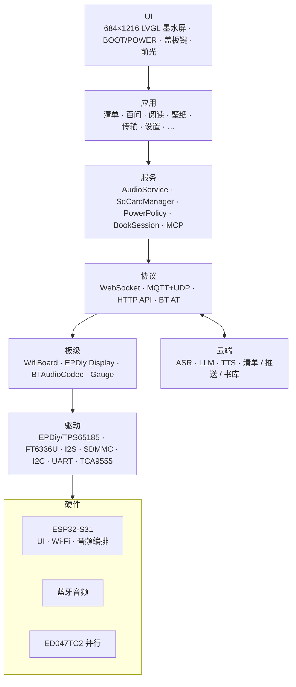
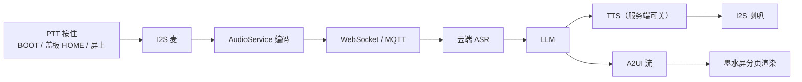
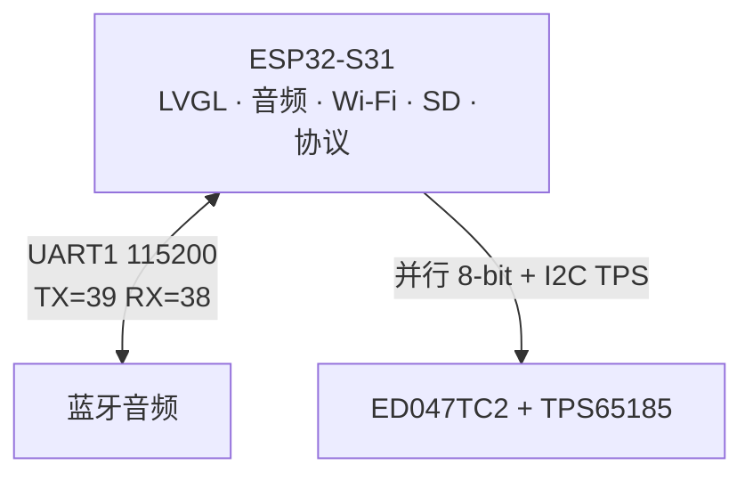
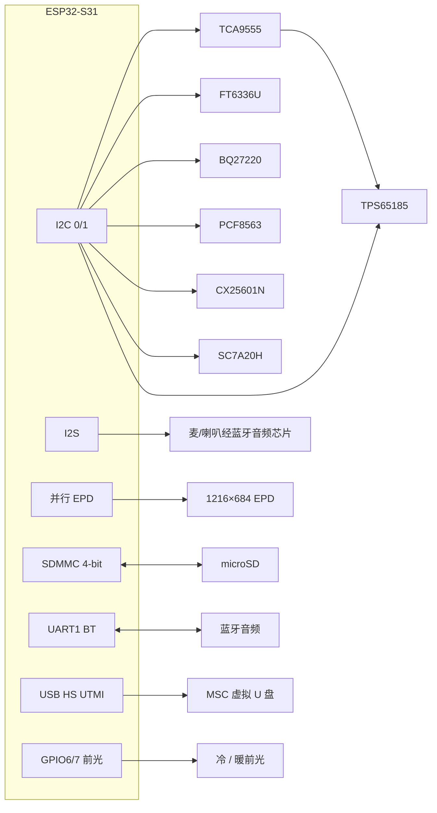
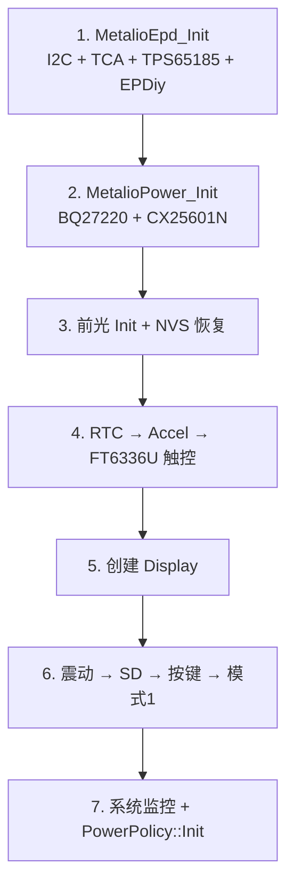

# Metalio E-Ink4-Plus

<p align="center">
  
</p>

**中文** | [English](README.md)

**快速链接**

- ESP-IDF 官方文档：[ESP32-S31 快速入门](https://docs.espressif.com/projects/esp-idf/zh_CN/v6.1/esp32s31/get-started/index.html)
- 同系列产品：[Metalio E-Ink 4](https://github.com/CloudZao/Metalio-E-INK4)（3.97 寸 SPI）

---

## 目录

1. [产品概述](#1-产品概述)
2. [核心特性](#2-核心特性)
3. [应用场景](#3-应用场景)
4. [系统架构](#4-系统架构)
5. [硬件规格](#5-硬件规格)
6. [网络架构](#6-网络架构)
7. [外设与引脚](#7-外设与引脚)
8. [原理图与资料](#8-原理图与资料)
9. [软件架构](#9-软件架构)
10. [云端服务与 API](#10-云端服务与-api)
11. [内置应用](#11-内置应用)
12. [通信协议](#12-通信协议)
13. [开发环境](#13-开发环境)
14. [编译与烧录](#14-编译与烧录)
15. [调试与常见问题](#15-调试与常见问题)

---

## 1. 产品概述

**Metalio E-Ink4-Plus** 是一款面向阅读与 AI 助手场景的开源墨水屏实体设备。整机搭载 **4.7 寸并行** 电子纸（**ED047TC2**，原生 **1216×684** / UI 竖屏 **684×1216**），由 **EPDiy** + **TPS65185** 驱动；配备 **FT6336U** 电容触控、盖板虚拟键、冷暖双路前光、I2S 麦克风与扬声器（经外置蓝牙音频芯片）、microSD（**SDMMC 4-bit**）、片上 Wi‑Fi、SC7A20H 三轴加速度计、PCF8563 RTC、BQ27220 电量计、震动马达，以及 USB MSC 虚拟 U 盘。设备可通过语音与云端 AI 交互，并支持本地书库阅读、云端资源推送、待机壁纸、SD 存储与低功耗管理。

| 属性 | 说明 |
|:---|:---|
| **产品名称** | Metalio E-Ink4-Plus |
| **板级标识** | `metalio-e-ink4-plus`（`BOARD_NAME` / 配网 AP 前缀 `MetalioEInk4Plus`） |
| **主控芯片** | **ESP32-S31**（RISC-V；Flash **16 MB**，Octal PSRAM @ **200 MHz**） |
| **屏幕** | 4.7 寸并行墨水屏，ED047TC2_1216；FT6336U 触控；冷暖前光 |

产品数据落在 SD 的 `metalio/e-ink/`，云端接口走 **ink-screen** 推送与书库同步；墨水屏采用全刷 / 局刷，列表与阅读页禁止滚动。

> 相对 [Metalio E-Ink 4](https://github.com/CloudZao/Metalio-E-INK4)：Plus 换用 **ESP32-S31**、**更大尺寸并行屏** + 前光，以及不同的引脚 / USB 架构。**勿复用 397 SPI 引脚表。**

---

## 2. 核心特性

### 2.1 AI 语音交互

- **流式 ASR / LLM / TTS**：经 WebSocket 或 MQTT+UDP 上云
- **百问 AI**：Push-to-Talk + A2UI 组件分页展示；可语音创建每日清单（见 [§11.2](#112-百问-aiassistant)）

### 2.2 墨水屏阅读体验

- **电子纸专用 UI**：LVGL I1 / A2I1（经 EPDiy）；全刷与局刷策略；列表与阅读页 **禁止滚动**，用盖板虚拟键或音量键（TCA9555 **P1.0**+ / **P1.1**−）翻页
- **逻辑 UI 尺寸**：684×1216，并遵守 `config.h` 中 `DISPLAY_CONTENT_*` 内缩
- **书库**：九宫格封面 + 书名 → 详情大图 → 正文；支持 `.ebook` / `.epub` / `.txt`
- **字体**：Flash `font_data` 分区挂载 UI fontpack；阅读字体 `.ef` 可放 SD 或经「传输」下载
- **工具链**：`tools/ebook/` 可将 PDF/EPUB/MOBI/TXT 等转为设备可读 `.ebook`（含 Web 预览）

### 2.3 多模态与本地能力

- **每日清单**：云端 checklist 同步，本地缓存只读展示（待机页复用）
- **壁纸**：SD 壁纸库；可设为待机全屏图 / 关机图
- **传输**：云端推送书籍、壁纸、字体到本机 SD
- **前光**：冷 / 暖 / 同开 / 关（设置 → 前光；GPIO6/7）
- **传感器**：SC7A20H 三轴加速度计；PCF8563 RTC；BQ27220 电量计

### 2.4 连接能力

- **Wi-Fi**：ESP32-S31 片上 2.4 GHz；配网 AP 名形如 `MetalioEInk4Plus-xxxx`
- **蓝牙音频**：外置蓝牙音频芯片（UART AT），三种工作模式（见 [§12.1](#121-蓝牙音频与三种模式)）
- **虚拟 U 盘**：设置「存储」可将 microSD 以 USB MSC 暴露给电脑（S31 **HS UTMI** TinyUSB；通路由 **ANA_SW** GPIO36 切换）

### 2.5 电源与续航

- **单节锂电** + TI **BQ27220** 电量计（I2C 0x55）；SOC 由电压线性估算（详见 `docs/battery-soc-and-charge.md`）
- **充电**：**USB → CX25601N**（I2C 0x6B）；默认充电电流 **1000 mA**
- **开关机**：侧面电源键（TCA9555 **P1.7**）；固件经 **P1.3**（`PWR_KEY_PULSE`）输出脉冲做软件关机
- **空闲策略**（「设置 → 功耗」，`PowerPolicy`）：
  - **无操作进浅睡待机**：默认 **3 分钟**（可选 10 / 30 分钟）→ 待机 Overlay（经典时钟 / 壁纸）
  - **浅睡累计关机**：默认 **3 分钟**（可选 10 / 30 分钟）
  - **AppIdle CPU**：80 / 160 / **240 MHz**（默认 240）；可关 Wi-Fi 降功耗
  - **断网暂留**：无保网需求后仍保网 **30 / 60 / 120 秒**
- **按键**：
  - **POWER 短按**：进入 / 退出待机 Overlay
  - **POWER 长按 ~3 s**：硬关机
  - **BOOT 长按 ~500 ms**：百问 PTT / 待机穿透等（`power_policy.h`）

功放使能为 TCA9555 **P0.4**（`PA_EN`，NS4150 CTRL），由功耗策略按通话 / Speaking / 音频测试等场景开关。

---

## 3. 应用场景

首页启用以下六个应用（`home_screen.cc` → `kApps[]`）：

| 应用 | 典型用途 |
|:---|:---|
| **每日清单** | 云端待办：同步、完成、删除 |
| **百问 AI** | 按住说话问答 + A2UI；可语音创建每日清单 |
| **阅读** | 本地书库浏览与分页阅读（音量键 P1.0 / P1.1） |
| **壁纸** | 壁纸库；待机 / 关机图 |
| **传输** | 云端推送书籍、壁纸、字体 |
| **设置** | 网络、主题、语言、震动、功耗、前光、对话、存储、蓝牙、测试、关于 |

---

## 4. 系统架构



### 4.1 语音数据通路（百问）



---

## 5. 硬件规格

| 类别 | 规格 |
|:---|:---|
| **主控** | ESP32-S31；Flash 16 MB；Octal PSRAM @ 200 MHz |
| **存储** | 板载 Flash（`partitions/v1/16m.csv`）+ microSD（SDMMC **4-bit**） |
| **显示** | ED047TC2_1216，约 4.7 寸，原生 1216×684 / UI 684×1216；EPDiy 并行 8-bit；TPS65185 PMIC |
| **触控** | FT6336U（I2C 0x38）；INT=GPIO5；RST=TCA9555 **P1.2**（高=上电） |
| **前光** | 冷 GPIO6 / 暖 GPIO7（YX6016N EN/PWM） |
| **盖板键** | HOME / PREV / NEXT（FT 坐标；见 [§7.1](#71-esp32-s31-gpio)） |
| **音频** | 外置蓝牙音频芯片 + I2S 全双工 @ 16 kHz；编解码 / 喇叭 / 耳机 |
| **网络** | 片上 Wi-Fi |
| **蓝牙** | 外置蓝牙音频芯片 UART（GPIO 39/38，115200）；非 ESP 经典蓝牙协议栈 |
| **传感器** | SC7A20H 加速度计（INT 与 TCA INT 同进 GPIO2）；PCF8563 RTC（INT = TCA **P1.6**） |
| **电源** | 单节 + BQ27220；CX25601N 充电；面板 TPS65185；轨控经 TCA **P0.5** / **P1.4** |
| **震动** | TCA9555 **P0.3** 马达（高有效；默认约 50 ms 脉宽） |
| **功放** | TCA9555 **P0.4**（`PA_EN`） |
| **按键** | BOOT（GPIO61）；电源 = TCA **P1.7**；音量+ = **P1.0**，音量− = **P1.1** |
| **USB** | S31 HS UTMI MSC 虚拟 U 盘；**ANA_SW**（GPIO36）选路 |

---

## 6. 网络架构

Metalio E-Ink4-Plus 以 **ESP32-S31** 片上 Wi-Fi 为中心：



| 单元 | 角色 | 接口 | 职责 |
|:---|:---|:---|:---|
| **ESP32-S31** | 主机 | — | UI、音频编排、Wi-Fi、SD、协议、MCP、阅读 |
| **蓝牙音频** | 编解码 / 喇叭 / 耳机 | UART AT + I2S | 三种模式（§12.1） |
| **TPS65185** | 面板 PMIC | I2C（经 TCA 控制脚） | VCOM / 上电 / PWR_GOOD |

> 联网靠 Wi-Fi。在 **设置 → 网络** 中配网与连接。

---

## 7. 外设与引脚

引脚：`main/boards/metalio-e-ink4-plus/config.h`  
板级胶合：`main/boards/metalio-e-ink4-plus/display/epd_board_metalio_eink4_plus.c`  
（硬件版本差异见 `config.h` 注释，如 V1.3–V1.4 的 XSTL / MODE。）

### 7.1 ESP32-S31 GPIO

| 功能 | GPIO | 说明 |
|:---|:---:|:---|
| I2C SDA | 0 | 共用：TCA9555、FT6336U、BQ27220、RTC、充电、加速度计、TPS65185 |
| I2C SCL | 1 | |
| IO 扩展 INT | 2 | TCA（+ 加速度计 INT 线与） |
| EPD XSTL | 4 | V1.3/V1.4 |
| 触控 INT | 5 | FT6336U |
| 前光冷 / 暖 | 6 / 7 | |
| EPD D0–D7 | 8–15 | 并行数据 |
| EPD XCL / XLE / XOE | 16 / 17 / 18 | |
| EPD MODE | 19 | V1.4 |
| SDMMC D0–D3 | 20–23 | 4-bit |
| SDMMC CLK / CMD | 24 / 25 | |
| EPD SPV / BORDER / CKV | 35 / 37 / 40 | |
| ANA_SW | 36 | MSC 选路（低 = 虚拟 U 盘） |
| 蓝牙音频 TX / RX | 39 / 38 | UART1，115200 |
| I2S BCLK / WS / DOUT / DIN | 42 / 43 / 44 / 45 | 全双工 |
| BOOT | 61 | |

**盖板虚拟键坐标**（FT 原生；Y≈1600 在屏外）：

| 键 | X | Y | 典型用途 |
|:---|:---:|:---:|:---|
| HOME | 100 | 1600 | 返回 / 百问 PTT 长按 |
| PREV | 200 | 1600 | 返回 / 上页 |
| NEXT | 300 | 1600 | 下页 |

### 7.2 TCA9555（I2C 16-bit，地址 0x20）

| 逻辑脚 | 硬件 | 方向 | 功能 |
|:---|:---|:---:|:---|
| VCOM_CTRL | P0.0 | OUT | TPS65185 VCOM |
| PWRUP | P0.1 | OUT | TPS65185 上电 |
| WAKEUP | P0.2 | OUT | TPS65185 唤醒 |
| MOTOR | P0.3 | OUT | 震动（高有效） |
| PA_EN | P0.4 | OUT | NS4150 功放使能 |
| CAM_SCR_EN | P0.5 | OUT | 摄像/屏幕电源轨 |
| PWR_GOOD | P0.7 | IN | TPS65185 PG |
| VOLUME_UP | P1.0 | IN | 音量 + |
| VOLUME_DOWN | P1.1 | IN | 音量 − |
| TP_RST | P1.2 | OUT | FT6336 电源/RST（高=开） |
| PWR_KEY_PULSE | P1.3 | OUT | 关机脉冲到开关机芯片 |
| BT_PA_PWR | P1.4 | OUT | 蓝牙 + 功放电源 |
| RTC_INT | P1.6 | IN | PCF8563 INT |
| POWER | P1.7 | IN | 电源键 |

> 原理图「P1x」指 Port1 bit x，勿与十进制脚号混淆。

### 7.3 I2C 地址

| 器件 | 7-bit 地址 | 说明 |
|:---|:---:|:---|
| TCA9555 | 0x20 | IO 扩展 |
| FT6336U | 0x38 | 触控 |
| PCF8563 | 0x51 | RTC |
| BQ27220 | 0x55 | 电量计 |
| CX25601N | 0x6B | 充电 |
| SC7A20H | 0x19（备选 0x18） | 加速度计 |
| TPS65185 | （PMIC） | 面板升压 / VCOM |

### 7.4 外设关系图



---

## 8. 原理图与资料

| 文档 | 路径 |
|:---|:---|
| 电池 / 充电策略 | [docs/battery-soc-and-charge.md](docs/battery-soc-and-charge.md) |
| 墨水屏 Bayer 抖动 | [docs/epd-bayer-dither-gray.md](docs/epd-bayer-dither-gray.md) |
| SD 字体 / 资源 | [docs/sd-font-resources-upgrade.md](docs/sd-font-resources-upgrade.md) |

固件引脚以 `config.h` / `epd_board_metalio_eink4_plus.*` 为准。若原理图另册发布，以硬件团队文档为准。

---

## 9. 软件架构

固件基于 xiaozhi-esp32，面向 `metalio-e-ink4-plus` 定制。CMake 工程名 `Metalio-E-Ink4-Plus`。

### 9.1 分层

| 层 | 路径 / 模块 | 职责 |
|:---|:---|:---|
| **入口** | `main.cc` → `Application` | 启动、事件循环、状态机 |
| **板级** | `boards/metalio-e-ink4-plus/` | 硬件初始化、EPDiy、触控、按键、前光 |
| **显示** | `display/screen/*`、`lv_adapter_*` | 应用、墨水刷新、状态栏 |
| **阅读** | `reader/`、`tools/ebook/` | 书籍会话、`.ebook` 工具链 |
| **音频** | `audio/` + 外置蓝牙 UART | 编解码、录放 |
| **协议** | `protocols/` | WebSocket、MQTT+UDP |
| **MCP** | `mcp_server.cc` | 端侧 Model Context Protocol |
| **功耗** | `boards/common/power_policy/` | 功耗档、待机、关机 |
| **公共** | `boards/common/` | Wi-Fi、SD、电量计、USB MSC、蓝牙编解码 |

### 9.2 状态机

`Application` 状态包括 starting → configuring → idle → connecting → listening ↔ speaking，以及 upgrading / activating / fatal_error 等。

- **idle**：百问等页面经 `PowerNeed` / 音频会话声明保网需求
- **listening / speaking**：流式 ASR / TTS
- **OTA**：双槽 `ota_0` / `ota_1`；全屏 `OtaUpgradeScreen`

### 9.3 板级初始化顺序

约 `MetalioEInk4PlusBoard` 构造序列：



### 9.4 目录树（摘录）

```
main/
├── application.cc                 # 启动、状态机、协议分发
├── cloudzao_endpoints.c           # 私有云主机/路径（开源版可为空）
├── api_endpoints.h                # URL 拼装（不含主机字面量）
├── boards/metalio-e-ink4-plus/    # 板级（config.h / EPDiy / FT6336 / 前光）
├── boards/common/                 # Wi-Fi、SD、电量计、功耗、USB MSC
├── display/screen/                # 应用、待机、OTA、设置
├── display/a2ui/                  # A2UI 渲染
├── reader/                        # 电子书会话
├── audio/                         # 录放
└── protocols/                     # WebSocket / MQTT

tools/ebook/                       # .ebook 转换、Web、模拟器
tools/fontpack/                    # UI 字体打包
partitions/v1/16m.csv              # 当前 16MB 分区表
use_font/font.fontpack             # 合并进 font_data
merge_firmware.sh                  # 编译并合并完整 bin
```

### 9.5 Flash 分区（`sdkconfig` → `partitions/v1/16m.csv`）

| 分区 | 约大小 | 用途 |
|:---|:---|:---|
| nvs / otadata / phy_init | 16K / 8K / 4K | NVS、OTA 元数据、PHY |
| model | 400K | 模型分区（SPIFFS） |
| ota_0 / ota_1 | 各 5MB | 双 OTA 应用 |
| resources | 400K | 资源 SPIFFS |
| font_data | 5MB | UI fontpack（mmap） |
| coredump | 64K | 崩溃转储 |

> 分区表偏移：`CONFIG_PARTITION_TABLE_OFFSET=0x8000`。

---

## 10. 云端服务与 API

云端主机与 HTTP 路径在 `main/cloudzao_endpoints.c` / `main/cloudzao_endpoints.h`。业务侧只通过 `main/api_endpoints.h` 拼 URL。当前开源构建中这些字符串可能有意留空，固件默认不走私有后端；若自建服务，填入真实值并保持符号名不变。

主语音通路仍为 **WebSocket / MQTT+UDP**。设备工具可通过 **MCP** 暴露给大模型。

---

## 11. 内置应用

首页列表：`home_screen.cc` → `kApps[]`（每页最多 12 个）。

### 11.0 首页应用

| 应用 | 说明 |
|:---|:---|
| **每日清单** | 云端清单 + 本地缓存；完成 / 删除 / 多选；虚拟键翻页 |
| **百问 AI** | 语音助手 + A2UI 分页；可语音创建每日清单（§11.2） |
| **阅读** | 书库九宫格 → 详情 → 正文；音量键（P1.0 / P1.1）翻页（§11.3） |
| **壁纸** | SD 图库；关机 / 待机（§11.4） |
| **传输** | 书籍 / 壁纸 / 字体统一推送列表（§11.5） |
| **设置** | 网络 / 主题 / 语言 / 震动 / 功耗 / 前光 / 对话 / 存储 / 蓝牙 / 测试 / 关于（§11.6） |

系统页（无首页图标）：**待机**、**OTA 升级**、设置内嵌 **蓝牙**。

---

### 11.1 每日清单（task）

- 读 `checklist_cache`；可从 API 刷新
- 完成 / 删除 / 多选；不滚动 — 用虚拟键
- 经典待机只读展示待办摘要

### 11.2 百问 AI（assistant）

见 `main/display/screen/assistant_screen/README.md`。

- 进入页启动语音会话；离开停止
- **多源 PTT**：BOOT / 盖板 HOME / 屏上；按住约 **500 ms** 开始听，松手结束
- 服务端下发 **A2UI**；设备按字形度量分页；`vk_prev` / `vk_next`
- **语音创建每日清单**：对话可在云端建待办并刷新本地 `checklist_cache`
- 会话可落盘 `/sdcard/metalio/e-ink/chat_log/`（开机清空；无 SD 时仅 RAM）
- 图片缓存：`.../a2ui_cache/`（开机清空）
- 设置 → 对话 跟随服务端 TTS 偏好

### 11.3 阅读（book）

- 路径：`/sdcard/metalio/e-ink/books`（界面展示 `metalio/e-ink/books`）
- 格式：`.ebook` / `.epub` / `.txt`；`.txt.idx` 索引；侧车封面 `.a2i1`
- 字体：`.../fonts/*.ef`
- 排版偏好在 NVS；列表/正文 **禁止滚动**；虚拟键 / 音量键翻页
- 开机可经 `library/sync` 同步进度
- PC 转换：`tools/ebook/README.md`

### 11.4 壁纸与待机

- 图库：`/sdcard/metalio/e-ink/wallpaper`，九宫格浏览 / 启用
- **待机路由**（`standby_screen`）：
  - 已启用待机壁纸 → 全屏 A2I1
  - 否则 → 经典（日期 / 农历 / 天气 / 待办）
- 关机图：优先 NVS 壁纸，否则内置 `bg_shutdown.a2i1`

### 11.5 传输（cloud）

- 页签：全部 / 壁纸 / 书籍 / 字体；**刷新**拉取推送队列
- 落地目录：BOOK→`books`，BADGE→`wallpaper`，FONT→`fonts`
- 状态栏固定标题「传输」（无时钟）

### 11.6 设置

| 页签 | 内容 |
|:---|:---|
| **网络** | Wi-Fi 配网与连接 |
| **主题** | 首页卡片样式 |
| **语言** | UI 语言 |
| **震动** | 按键震动开 / 关 |
| **功耗** | AppIdle CPU、待机延时、断网暂留、累计关机 |
| **前光** | 冷 / 暖 / 同开 / 关 + 亮度 |
| **对话** | 百问 TTS 服务端偏好 |
| **存储** | SD 容量；**开 / 关虚拟 U 盘** |
| **蓝牙** | 模式 1/2/3、扫描/配对（§12.1） |
| **测试** | 工厂 / 老化入口 |
| **关于** | 型号、芯片、固件版本、MAC、Flash、PSRAM |

### 11.7 SD 目录布局

产品根：`/sdcard/metalio/e-ink/`（`sd_paths.h`）

| 路径 | 用途 |
|:---|:---|
| `.../books` | 电子书、封面、索引 |
| `.../fonts` | 阅读 `.ef` 字体 |
| `.../wallpaper` | 壁纸 / 关机图 |
| `.../chat_log` | 百问会话 JSON（开机清空） |
| `.../a2ui_cache` | A2UI 图片缓存（开机清空） |
| `.../recordings` | Opus 录音（若启用录音应用） |

---

## 12. 通信协议

| 协议 | 用途 |
|:---|:---|
| **WebSocket** | 流式语音（ASR/LLM/TTS） |
| **MQTT + UDP** | 备选上行 |
| **MCP** | 向 LLM 暴露设备工具 |
| **HTTP** | 清单、天气、推送、书库、TTS 偏好、ASR |
| **BT AT** | 外置蓝牙音频模块 |

### 12.1 蓝牙音频与三种模式

ESP32-S31 经 **UART1**（115200，GPIO 39/38）发 AT。设置 → 蓝牙嵌入 `BluetoothScreen`。**非** ESP 经典蓝牙协议栈。

| 模式 | AT 序列（每条以 `\r\n` 结尾） | 含义 | 如何进入 |
|:---:|:---|:---|:---|
| **1** | `AT+RX=2` →（约 700 ms）→ `AT+MODE=1` | 百问通话（开机默认） | 开机自动；设置 |
| **2** | `AT+TX=1` → → `AT+MODE=2` | 发射 / 配对；经蓝牙耳机对话 | 设置 → 蓝牙 → 模式 2 |
| **3** | `AT+RX=1` → → `AT+MODE=3` | 音乐接收（设备当音箱） | 设置 |

> 模式 2 对话需要 **带麦** 耳机。开机在 `MetalioAudio_Init` 后应用模式 1。

---

## 13. 开发环境

### 13.1 环境要求

| 项 | 要求 |
|:---|:---|
| **ESP-IDF** | **v6.1**（须与仓库 `sdkconfig` / S31 支持一致） |
| **Target** | `esp32s31`（已预配置；通常无需 `set-target`） |
| **板型** | Metalio E-Ink4-Plus（`main/boards/metalio-e-ink4-plus/`） |
| **系统** | Linux / macOS / Windows（推荐 WSL2） |
| **Python** | 3.8+（IDF 虚拟环境） |

### 13.2 安装 ESP-IDF

> [ESP32-S31 快速入门 — ESP-IDF v6.1](https://docs.espressif.com/projects/esp-idf/zh_CN/v6.1/esp32s31/get-started/index.html)

```bash
# 推荐用 ESP-IDF Installation Manager（EIM），或：
git clone -b v6.1 --recursive https://github.com/espressif/esp-idf.git
cd esp-idf
./install.sh esp32s31
. ./export.sh
idf.py --version
```

### 13.3 获取源码

```bash
git clone <your-repo-url>
cd xingzhi-ai-470
```

> 仓库自带板级调好的 `sdkconfig`；一般直接 `idf.py build` 即可。

### 13.4 关键配置摘要

| 项 | 值 | 说明 |
|:---|:---|:---|
| ESP-IDF | v6.1 | 必须匹配 |
| Target | esp32s31 | 已预配置 |
| Flash | 16MB | `partitions/v1/16m.csv` |
| PSRAM | Octal 200 MHz | |

---

## 14. 编译与烧录

### 14.1 编译

```bash
. ~/esp/v6.1/export.sh   # 按本机路径调整

idf.py build
```

### 14.2 关于 sdkconfig

**请勿随意改 `sdkconfig`。** 已针对墨水屏、PSRAM、分区调优；错误修改可能导致刷新、Wi-Fi 或 SD 挂载异常。

### 14.3 合并完整固件（发布）

```bash
./merge_firmware.sh
# 或：IDF_PATH=~/esp/v6.1 ./merge_firmware.sh
```

按 `build/flash_args` 编译并合并（含将 `use_font/font.fontpack` 写入 `font_data`）：

- `firmware/metalio-e-ink4-plus-{PROJECT_VER}.bin`
- 根目录 `metalio-e-ink4-plus.bin`
- `daily-builds/...`（本地归档）

### 14.4 烧录与监视

```bash
# 按本机改端口
idf.py -p /dev/ttyACM0 flash monitor
```

ESP32-S31 上 USB Serial/JTAG 与 HS MSC 使用不同 PHY；若已开虚拟 U 盘，烧录前仍建议安全弹出。

### 14.5 SD 卡与虚拟 U 盘

1. 格式化为 FAT32 后插入。
2. 按 §11.7 将资源放到 `metalio/e-ink/...`（PC 上不要再套一层名为 `sdcard` 的目录）。
3. 设置 → 存储 → 开启虚拟 U 盘；拷贝后安全弹出；再关闭。

USB 描述符示例：`Metalio` / `Metalio Ink SD`（TinyUSB）。开启 MSC 时会将 **ANA_SW**（GPIO36）置低。

### 14.6 电子书转换（PC）

见 `tools/ebook/README.md`。输出拷到 SD 的 `metalio/e-ink/books/` 供阅读应用使用。

---

## 15. 调试与常见问题

### 15.1 常用日志 Tag

| Tag | 模块 |
|:---|:---|
| MetalioEInk4Plus | 板级初始化 |
| epd_eink4p | EPDiy / TCA / TPS65185 |
| PowerPolicy / power_hw | 低功耗 / 关机 |
| AssistantScreen | 百问 AI |
| BookScreen | 阅读 |
| CloudScreen | 传输 |
| BluetoothScreen | BT AT |
| Frontlight | 冷暖前光 |
| UsbVirtualDisk | MSC |

### 15.2 工厂测试入口

设置 → 测试：工厂 / 老化入口。普通用户可忽略。

### 15.3 常见问题

**Q: ESP-IDF 版本不对**

请用 **v6.1**，目标芯片 **esp32s31**，并执行 `export.sh`。

**Q: 屏幕不刷新 / 花屏**

1. 确认未破坏 `sdkconfig` 与面板参数
2. 检查经 TCA 的 TPS65185 上电（VCOM / PWRUP / WAKEUP / PWR_GOOD）
3. 核对 `config.h` 并行总线脚（版本相关的 XSTL / MODE）

**Q: 触摸失灵**

检查 FT6336 RST（TCA P1.2 为高）、INT（GPIO5）以及共用 I2C 0/1。

**Q: Wi-Fi 配网**

设置 → 网络 → Wi-Fi；连接 AP `MetalioEInk4Plus-*`，按机内指引操作。

**Q: SD 挂载失败**

FAT32；检查 SDMMC 4-bit 脚（GPIO20–25）；S31 上必要时确认 CNNT SDIO pad 已释放给 GPIO。

**Q: 虚拟 U 盘**

在设置 → 存储中开启；**ANA_SW** 会置低。关闭前请安全弹出。

**Q: 空闲后进待机或关机**

属预期行为 — 见 §2.5。可在设置 → 功耗中调整。

**Q: 电量跳变 / 充电图标异常**

见 `docs/battery-soc-and-charge.md`。UI SOC 为电压估算；默认 ICHG 为 1000 mA。

**Q: 推送 / 书库 API 失败**

确认网络；若用私有后端请填写 `cloudzao_endpoints.c`；在「传输」里点 **刷新**。

**Q: 与 Metalio E-Ink 4 搞混**

Plus 是 **S31 + 并行 4.7 寸 + FT6336 + 前光**。397 是 **S3 + SPI 3.97 寸 + CST816S**。引脚表不可互换。

---

_本文档随固件演进更新。引脚与行为以源码为准；若文档与硬件不符请提 Issue。_
